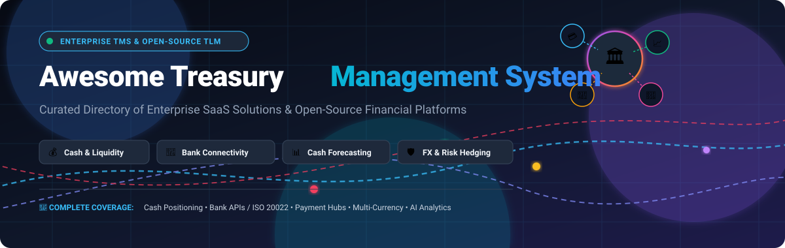

# 🏛️ Awesome Treasury Management System (TMS)

<p align="center">
  
</p>

<p align="center">
  <a href="https://github.com/ishandutta2007/Awesome-Awesome-Awesome"></a>
  <a href="https://discord.gg/jc4xtF58Ve"></a>
  <a href="https://github.com/ishandutta2007/Awesome-Treasury-Management-System/stargazers"></a>
  <a href="https://github.com/ishandutta2007/Awesome-Treasury-Management-System/network/members"></a>
  <a href="https://github.com/ishandutta2007/Awesome-Treasury-Management-System/issues"></a>
  <a href="https://github.com/ishandutta2007/Awesome-Treasury-Management-System/pulls"></a>
  <a href="https://github.com/ishandutta2007/Awesome-Treasury-Management-System/blob/main/LICENSE"></a>
  <a href="https://github.com/ishandutta2007"></a>
</p>

---

## 🌟 Overview & TMS Ecosystem

> **Curated Directory of Enterprise SaaS Platforms & Open-Source Treasury Management Infrastructure**  
> *Covering Cash & Liquidity Management, Cash Forecasting, Bank Connectivity (ISO 20022, APIs, SWIFT, EBICS), Multi-Banking Payment Hubs, FX Risk Hedging, Debt & Investment Portfolios, Intercompany Netting, Bank Reconciliation, and AI-Driven Treasury Analytics.*  
> **Last updated: August 2026**

This repository provides an authoritative, SEO-optimized directory and architectural guide for **Treasury Management Systems (TMS)**, **Treasury and Liquidity Management (TLM)**, **Corporate Cash Management**, and **Financial Risk Infrastructure**.

Modern corporate treasury teams, CFOs, financial controllers, fintech developers, and ERP architects rely on these platforms to automate:
- 💰 **Real-Time Cash Positioning & Global Liquidity Visibility**
- 🏦 **Multi-Bank Connectivity (Host-to-Host, SFTP, Open Banking APIs, SWIFT, EBICS, ISO 20022 XML, MT940)**
- 📊 **Automated & AI-Assisted Cash Flow Forecasting (13-Week, Daily, Monthly, and Scenario Modeling)**
- 💳 **Centralized Payment Hubs, Dual Approvals, Sanctions Screening & Fraud Detection**
- 💱 **Foreign Exchange (FX) Exposure Tracking, Interest Rate Risk, and Hedge Accounting (IFRS 9 / ASC 815)**
- 📜 **Debt Facility Tracking, Covenant Compliance, and Investment Portfolio Optimization**
- 🔄 **Automated Bank Reconciliation, Cash Pooling, Sweeping, and In-House Banking / Netting**

---

## 📑 Table of Contents

- [🏢 SaaS & Enterprise Hosted Platforms](#-saas--enterprise-hosted-platforms)
- [💻 Open-Source GitHub Projects](#-open-source-github-projects)
- [🏗️ Enterprise TMS Architectural Blueprint](#-enterprise-tms-architectural-blueprint)
  - [1. Bank Connectivity Layer](#1-bank-connectivity-layer)
  - [2. Cash Positioning Architecture](#2-cash-positioning-architecture)
  - [3. Cash Forecasting Layer](#3-cash-forecasting-layer)
  - [4. Liquidity & Cash Pooling Management](#4-liquidity--cash-pooling-management)
  - [5. FX Risk Management & Hedging](#5-fx-risk-management--hedging)
  - [6. Debt & Investment Management](#6-debt--investment-management)
  - [7. Payment Control & Security Layer](#7-payment-control--security-layer)
  - [8. Treasury Analytics & AI Layer](#8-treasury-analytics--ai-layer)
- [🧩 Recommended Open-Source Treasury Stack](#-recommended-open-source-treasury-stack)
- [🤝 How to Contribute](#-how-to-contribute)
- [⭐ Star History](#-star-history)
- [⚠️ Disclaimer](#️-disclaimer)

---

## 🏢 SaaS & Enterprise Hosted Platforms

The table below catalogs leading commercial Treasury Management Systems (TMS), sorted in **descending order by company size** (Market Capitalization / Valuation / Revenue scale).

| 🏢 Platform | 🌐 Company Size (Valuation / Revenue) | 🎯 Focus & Key Capabilities | 🏷️ Starting Pricing | 🎁 Free Tier / Trial Limits |
| :--- | :--- | :--- | :--- | :--- |
| **[Oracle Cloud Treasury](https://www.oracle.com/erp/financials/)** | **~$400B+ Market Cap**<br>*(~$53B+ Annual Revenue)* | Cloud-native cash and treasury management embedded within Oracle Fusion Cloud Financials ERP, covering global payments, bank account management (BAM), and automated cash positioning. | Starts at **$600/user/month**<br>*(~$7,200/user/year; min 10 users = $72,000/year)* | **30-day Free Trial with $300 cloud credits** (includes Oracle Always Free cloud tier services; dedicated ERP Treasury sandbox accessible via sales consultation). |
| **[SAP Treasury and Risk Management](https://www.sap.com/)** | **~$260B+ Market Cap**<br>*(~$34B+ Annual Revenue)* | Comprehensive enterprise treasury, exposure management, financial asset trading, yield curve analysis, and hedge accounting integrated directly in SAP S/4HANA Cloud. | Starts at **$3,500/month**<br>*(~$42,000/year base add-on subscription for SAP S/4HANA Cloud Treasury packages)* | **14-day SAP S/4HANA Cloud Trial** (includes interactive guided tours, pre-configured cash position sheets, and test financial simulation data). No free-forever plan. |
| **[FIS Integrity & Quantum](https://www.fisglobal.com/)** | **~$45B+ Market Cap**<br>*(~$10B+ Annual Revenue)* | Mission-critical tier-1 enterprise TMS handling complex multi-entity cash pooling, global payments, investment portfolios, debt servicing, and hedge accounting. | Starts at **$75,000/year**<br>*(~$6,250/month for Integrity SaaS core cash tier)* | **14-day guided sandbox pilot** for qualified institutional buyers (pre-loaded with regulatory, accounting, and multi-bank simulation data). No free-forever plan. |
| **[Coupa Treasury](https://www.coupa.com/)** *(BELLIN tm5)* | **~$8.0B Valuation**<br>*(~$800M+ Annual Revenue)* | Enterprise TMS offering global multi-bank payments, multilateral netting, cash visibility, FX risk management, and in-house banking (tm5 platform). | Starts at **$40,000/year**<br>*(~$3,333/month for entry-level tm5 cash management suite)* | **14-day guided proof-of-concept trial** in pre-configured staging sandbox with sample corporate hierarchies and netting runs. No free-forever plan. |
| **[HighRadius Treasury](https://www.highradius.com/)** | **~$3.1B Valuation**<br>*(~$150M+ Annual Revenue)* | Autonomous AI-driven cash forecasting, automated cash positioning, bank statement reconciliation, and working capital optimization suite. | Starts at **$50,000/year**<br>*(~$4,167/month for AI Cash Forecasting module)* or **$0 upfront pilot** via Outcome-Based Pricing | **30-day value-proof assessment / pilot** (limited to single-entity cash forecasting and 1-year historical dataset backtesting). No free-forever plan. |
| **[Kyriba](https://www.kyriba.com/)** | **~$3.0B+ Valuation**<br>*(~$300M+ Annual Revenue)* | Enterprise treasury and liquidity-performance platform covering real-time cash visibility, cash forecasting, payments, FX/risk management, working capital, and multi-bank connectivity. | Starts at **$50,000/year**<br>*(~$4,166/month billed annually for core mid-market entry tier; typical 1st-year entry deployment is ~$100,000 including implementation)* | **14-day guided sandbox demo/POC** upon enterprise qualification (includes simulated bank feeds, forecasting engine, and core cash dashboard access). No free-forever plan. |
| **[TreasuryXpress](https://www.treasuryxpress.com/)** *(Bottomline)* | **~$2.6B Valuation**<br>*(~$450M+ Parent Revenue)* | Modular, scalable TMS platform focused on frictionless cash visibility, liquidity forecasting, payment workflows, bank connectivity, and multi-bank reporting. | Starts at **$12,000/year**<br>*(~$1,000/month for C2Direct entry cash visibility tier)* | **30-day Proof of Concept (POC) trial** (limited to 5 connected accounts and test bank statement feeds upon sales qualification). No free-forever plan. |
| **[ION Treasury](https://iongroup.com/)** *(Reval / IT2 / Wallstreet)* | **~$2.5B+ Valuation**<br>*(~$350M+ Annual Revenue)* | Multi-product enterprise treasury and risk suite for global cash management, complex debt facilities, hedging, commodities, and derivatives trading. | Starts at **$60,000/year**<br>*(~$5,000/month for Reval core cloud SaaS tier)* | **14-day custom POC sandbox trial** for qualified enterprise treasury teams with simulated portfolio trades. No free-forever plan. |
| **[GTreasury](https://www.gtreasury.com/)** | **~$1.0B+ Valuation**<br>*(~$100M+ Annual Revenue)* | Enterprise TMS covering cash positioning, liquidity forecasting, debt instruments, investments, FX risk, payment orchestration, and financial reporting. | Starts at **$50,000/year**<br>*(~$4,167/month for core cash & liquidity module)* | **14-day guided custom sandbox trial** for qualified enterprise teams (includes sample transaction datasets and core liquidity workspace). No free-forever plan. |
| **[Agicap Treasury](https://agicap.com/)** | **~$500M+ Valuation**<br>*(~$40M+ Annual Revenue)* | Real-time cash flow management and liquidity planning suite for SMBs and mid-market companies with automated bank sync and AP/AR management. | Starts at **€150/month**<br>*(~€1,800/year billed annually for core cash flow forecasting tier)* | **14-day free trial** (limited to 2 connected bank accounts, 1 user seat, and 12-month cash forecasting horizon). No free-forever plan. |
| **[Hazeltree](https://www.hazeltree.com/)** | **~$350M+ Valuation**<br>*(~$35M+ Annual Revenue)* | Specialized treasury and collateral management platform engineered for hedge funds, private equity funds, and institutional asset managers. | Starts at **$36,000/year**<br>*(~$3,000/month for core cash & collateral module)* | **14-day interactive sandbox trial** upon demo qualification (limited to test portfolio and margin data). No free-forever plan. |
| **[Nomentia](https://www.nomentia.com/)** | **~$250M+ Valuation**<br>*(~$30M+ Annual Revenue)* | Modular cloud treasury platform spanning multi-bank connectivity, central payment hub, liquidity forecasting, FX management, and in-house banking. | Starts at **€10,000/year**<br>*(~€833/month for entry-level payment hub or cash visibility module)* | **Free-forever tier for Treasury ROI Calculator & Analytics Benchmarking tools** (unlimited usage); **14-day sandbox trial** available for core modules upon sales validation. |
| **[TIS](https://www.tispayments.com/)** *(Treasury Intelligence Solutions)* | **~$200M+ Valuation**<br>*(~$25M+ Annual Revenue)* | Enterprise cloud platform for corporate payments, bank account management (BAM), sanction screening, and real-time multi-bank cash visibility. | Starts at **€15,000/year**<br>*(~€1,250/month for entry-level enterprise payment and bank connectivity hub)* | **14-day interactive sandbox access** upon qualification (restricted to simulated bank statement workflows and up to 3 test users). No free-forever plan. |
| **[Cobase](https://www.cobase.com/)** | **~$60M+ Valuation**<br>*(~$8M+ Annual Revenue)* | Multi-banking and cash management hub providing unified bank connectivity, automated statement feeds, payment hub, and cash balance visibility. | Starts at **€350/month**<br>*(~€4,200/year base platform fee + per-connected-bank account fees)* | **14-day sandbox test environment** (limited to 2 admin user logins and simulated MT940/CAMT.053 statement testing). No free-forever plan. |
| **[Salmon Software](https://www.salmonsoftware.ie/)** *(Salmon Treasurer)* | **~$40M+ Valuation**<br>*(~$6M+ Annual Revenue)* | Comprehensive TMS supporting cash management, debt, derivatives, trade finance, intercompany lending, netting, and bank reconciliation. | Starts at **€250/month**<br>*(~€3,000/year for entry SaaS cash tier; on-premise perpetual licenses start at €15,000)* | **14-day interactive demo sandbox** upon request (includes pre-loaded treasury transactions and report templates). No free-forever plan. |
| **[CashAnalytics](https://www.cashanalytics.com/)** *(GTreasury)* | **~$30M+ Valuation**<br>*(Part of GTreasury $1B+ Group)* | Automated cash forecasting and liquidity-planning platform with multi-source ERP ingestion, scenario modeling, and variance reporting. | Starts at **€420/month**<br>*(~€5,040/year billed annually for basic cash forecasting tier)* | **14-day free trial / guided pilot** upon request (limited to 3 user seats, 5 entity accounts, and standard ERP CSV uploads). No free-forever plan. |

---

## 💻 Open-Source GitHub Projects

The table below catalogs premier open-source treasury building blocks, core banking engines, financial ERPs, quantitative risk libraries, and bank connectivity parsers, **sorted in descending order by GitHub Star Count**.

| 💻 Repository | ⭐ GitHub Stars | ⚖️ License | 🛠️ Tech Stack | 📖 Description & Treasury Domain |
| :--- | :--- | :--- | :--- | :--- |
| **[Odoo](https://github.com/odoo/odoo)** | [](https://github.com/odoo/odoo/stargazers) | LGPL-3.0 | Python / JS | Enterprise open-source ERP with integrated cash management, automated bank synchronization, statement reconciliation, payment gateways, and cash position tracking. |
| **[Hyperswitch](https://github.com/juspay/hyperswitch)** | [](https://github.com/juspay/hyperswitch/stargazers) | Apache-2.0 | Rust | High-performance open-source financial payment switch and orchestration engine connecting banks, card processors, and global payout systems. |
| **[ERPNext](https://github.com/frappe/erpnext)** | [](https://github.com/frappe/erpnext/stargazers) | GPL-3.0 | Python / JS | Comprehensive open-source ERP foundation covering general ledger, multi-currency cash flow, banking feeds, automated reconciliation, and payment orders. |
| **[Firefly III](https://github.com/firefly-iii/firefly-iii)** | [](https://github.com/firefly-iii/firefly-iii/stargazers) | AGPL-3.0 | PHP / Blade | Self-hosted treasury, cash flow, double-entry bookkeeping, multi-account banking synchronization, and financial budget management engine. |
| **[Invoice Ninja](https://github.com/invoiceninja/invoiceninja)** | [](https://github.com/invoiceninja/invoiceninja/stargazers) | Elastic-2.0 | PHP / Flutter | Open-source invoicing, billing, accounts receivable (AR) cash tracking, payment gateways, and corporate transaction processing suite. |
| **[QuantLib](https://github.com/lballabio/QuantLib)** | [](https://github.com/lballabio/QuantLib/stargazers) | BSD-3-Clause | C++ / Python | Industry-standard quantitative finance framework for financial instrument modeling, yield curve bootstrapping, FX risk, fixed income valuation, and derivatives pricing. |
| **[Kill Bill](https://github.com/killbill/killbill)** | [](https://github.com/killbill/killbill/stargazers) | Apache-2.0 | Java | Open-source billing and payment orchestration platform designed for financial transaction management, payment routing, and audit logs. |
| **[Apache Fineract](https://github.com/apache/fineract)** | [](https://github.com/apache/fineract/stargazers) | Apache-2.0 | Java | Core banking and financial institution platform providing multi-entity account management, loan/deposit portfolios, and liquidity tracking. |
| **[FINOS Legend](https://github.com/finos/legend)** | [](https://github.com/finos/legend/stargazers) | Apache-2.0 | Java / TS | Fintech Open Source Foundation data modeling, validation, and analytics platform for enterprise financial institutions and regulatory data models. |
| **[OpenGamma Strata](https://github.com/OpenGamma/Strata)** | [](https://github.com/OpenGamma/Strata/stargazers) | Apache-2.0 | Java | Market risk and financial analytics library designed for treasury risk, interest rate curves, forward valuations, sensitivities, and hedge modeling. |
| **[Formance Stack](https://github.com/formancehq/stack)** | [](https://github.com/formancehq/stack/stargazers) | Apache-2.0 | Go | Programmable financial infrastructure & programmable multi-currency ledger for complex money movement, payment flows, and automated reconciliation. |
| **[Rateslib](https://github.com/attack68/rateslib)** | [](https://github.com/attack68/rateslib/stargazers) | AGPL-3.0 | Python | Fixed income and interest rate derivative analytics library for yield curves, FX swaps, cross-currency swaps (XCS), and risk sensitivity (delta/gamma). |
| **[Moqui Framework](https://github.com/moqui/moqui-framework)** | [](https://github.com/moqui/moqui-framework/stargazers) | CC0-1.0 | Java / Groovy | Enterprise financial application framework with Mantle Business Artifacts for cash accounting, payments, bank reconciliations, and general ledgers. |
| **[Tryton](https://github.com/tryton/tryton)** | [](https://github.com/tryton/tryton/stargazers) | GPL-3.0 | Python | Modular enterprise business and accounting ERP with double-entry accounting, bank statement imports, and multi-currency cash positioning. |
| **[ERP5 Banking](https://github.com/Nexedi/erp5)** | [](https://github.com/Nexedi/erp5/stargazers) | GPL-3.0 | Python | Enterprise open-source ERP with specialized banking, cash management, payment processing, and corporate treasury account features. |
| **[BankStatementParser](https://github.com/sebastienrousseau/bankstatementparser)** | [](https://github.com/sebastienrousseau/bankstatementparser/stargazers) | MIT | Python | High-speed multi-format bank statement parser supporting CAMT.053/ISO 20022, PAIN.001, MT940, OFX/QFX, and CSV formats. |
| **[Agentic TLM](https://github.com/chrisshayan/agentic-tlm)** | [](https://github.com/chrisshayan/agentic-tlm/stargazers) | MIT | Python | Experimental AI multi-agent treasury and liquidity management system prototype for cash flow optimization, risk management, and compliance. |
| **[TCMTreino](https://github.com/Sen2pi/TCMTreino)** | [](https://github.com/Sen2pi/TCMTreino/stargazers) | MIT | Java / React | Dedicated open-source treasury & collateral management system built with Spring Boot, React, Kafka, and PostgreSQL. |

---

## 🏗️ Enterprise TMS Architectural Blueprint

A resilient, scalable Treasury Management System connects transactions across banking, ERP, and risk systems:

```
Bank Account ───► Transaction ───► Cash Position ───► Forecast ───► Liquidity ───► Payment ───► Accounting ───► Risk Hedging
```

```
                          ┌─────────────────────────┐
                          │        ERP / GL         │
                          │ (SAP, Oracle, ERPNext)  │
                          └────────────┬────────────┘
                                       │
                          ┌────────────▼────────────┐
                          │   Treasury Core Engine  │
                          │ Cash + Risk + Payments  │
                          └────────────┬────────────┘
                                       │
                          ┌────────────▼────────────┐
                          │ Bank Connectivity Layer │
                          │ ISO 20022 / SWIFT / API │
                          └────────────┬────────────┘
                                       │
              ┌────────────────────────┼────────────────────────┐
              │                        │                        │
        ┌─────▼──────┐           ┌─────▼──────┐           ┌─────▼──────┐
        │   Bank A   │           │   Bank B   │           │   Bank C   │
        │  Accounts  │           │  Accounts  │           │  Accounts  │
        └────────────┘           └────────────┘           └────────────┘
```

---

### 1. 🏦 Bank Connectivity Layer

Bank connectivity bridges corporate systems and global banking networks using standardized protocols:

- **ISO 20022 XML Messages**:
  - `pain.001`: Customer Credit Transfer Initiation (Payment Instruction)
  - `pain.002`: Payment Status Report
  - `camt.052`: Bank-to-Customer Account Report (Intraday)
  - `camt.053`: Bank-to-Customer Statement (End-of-Day)
  - `camt.054`: Bank-to-Customer Debit/Credit Notification
- **Legacy Banking Formats**: SWIFT MT940 (End of Day), MT942 (Intraday), BAI2, OFX, Multicash
- **Transport Protocols**: Direct Host-to-Host (H2H) SFTP, AS2, EBICS (Europe), SWIFT Alliance Lite2 / SWIFTNet, Open Banking REST APIs (PSD2 / UK Open Banking / FDX)

---

### 2. 💰 Cash Positioning Architecture

The cash positioning engine computes real-time available liquidity across all legal entities, currencies, and bank accounts:

```
Bank Statements (CAMT.053 / MT940)
       +
ERP / GL Journal Transactions
       +
Pending Outgoing Payments & Approvals
       +
Accounts Receivable (AR) & Accounts Payable (AP)
       ↓
Transaction Normalization & Deduplication
       ↓
Automated Rule-Based Reconciliation (95%+ target match rate)
       ↓
Global Real-Time Cash Position
       ↓
Available Working Liquidity Buffer
```

$$\text{Available Liquidity} = \text{Book Balance} + \text{Pending Receipts} - \text{Pending Payments} + \text{Intercompany Net Sweeps} + \text{Maturing Investments} - \text{Debt Service}$$

---

### 3. 📊 Cash Forecasting Layer

Multi-horizon cash forecasting empowers treasury teams to foresee short-term liquidity bottlenecks and optimize long-term yields:

- **Forecasting Horizons**:
  - **Daily / 13-Week Operational Forecast**: Granular AR/AP receipts and disbursements for working capital.
  - **Monthly / Quarterly Tactical Forecast**: Payroll, tax payments, capex schedules, and debt maturities.
  - **Annual Strategic Forecast**: Business unit planning, dividend distributions, and credit facility planning.
- **Forecasting Inputs**: Historical ERP transactions, sales pipelines, open invoices, seasonal factors, FX forward settlements, and ML-driven statistical projections.

---

### 4. 🔄 Liquidity & Cash Pooling Management

Automate multi-entity fund movements to minimize external borrowing costs and maximize yield:

```
Entity A (USD) ────┐
Entity B (EUR) ────┼───► Central Treasury Master Pool / In-House Bank
Entity C (GBP) ────┘            │
                                ├─► Physical Cash Sweeps & Target Balancing
                                ├─► Notional Cash Pooling
                                ├─► Intercompany Loan & Interest Calculation
                                └─► Multilateral Payment Netting
```

- **Physical Sweeps**: Zero-balance accounts (ZBA) and target balancing.
- **Notional Pooling**: Offset credit and debit balances across accounts without physical movement.
- **In-House Banking (IHB)**: Virtual sub-accounts, centralized payments-on-behalf-of (POBO), and collections-on-behalf-of (COBO).

---

### 5. 💱 FX Risk Management & Hedging

Manage multi-currency volatility and ensure compliance with hedge accounting standards:

- **Exposure Identification**: Balance sheet translation exposure, cash flow transaction exposure, and economic exposure.
- **Risk Metrics**: Value-at-Risk (VaR), Cash Flow-at-Risk (CFaR), sensitivity analysis, and stress testing.
- **Hedging Instruments**: FX Spot, FX Forwards, Cross-Currency Swaps (XCS), Non-Deliverable Forwards (NDFs), and Currency Options.
- **Hedge Accounting**: Automated effectiveness testing and documentation under **IFRS 9** and **ASC 815**.

---

### 6. 📜 Debt & Investment Management

Track debt obligations and optimize short-term cash surpluses:

- **Debt Portfolio**: Term loans, revolving credit facilities (RCF), syndicated facilities, commercial paper, and corporate bonds. Automated amortization schedules, covenant compliance monitoring, and interest rate benchmark transitions (SOFR, EURIBOR, SONIA).
- **Short-Term Investments**: Money Market Funds (MMFs), Treasury Bills (T-Bills), Certificates of Deposit (CDs), and Repurchase Agreements (Repos) with counterparty exposure tracking.

---

### 7. 🛡️ Payment Control & Security Layer

Enforce strict governance and fraud prevention on outgoing financial transactions:

```
Payment Initiation ──► Sanctions & Blacklist Check ──► Dual Approval Matrix (SoD) ──► ISO 20022 Signature ──► Bank Transmission
```

- **Segregation of Duties (SoD)**: Enforce 4-eyes / 6-eyes approval workflows based on payment amount and entity.
- **Sanctions & Watchlist Screening**: Real-time screening against OFAC, EU, UN, and PEP lists.
- **Bank Account Verification**: Confirmation of Payee (CoP) and anomaly detection for beneficiary bank changes.

---

### 8. 🤖 Treasury Analytics & AI Layer

Modern TMS stacks combine analytical warehouses with machine learning models:

```
Treasury Data Lake ──► AI / ML Feature Store ──► Predictive Cash Models ──► Anomaly & Fraud Scoring ──► Treasury Copilot
```

- **Forecasting Variance Explanations**: Automated root-cause analysis on forecast vs. actual cash deviations.
- **Payment Anomaly Detection**: Unsupervised clustering to catch abnormal payment amounts or unusual beneficiary routing.
- **Natural Language Reporting**: Automated CFO summary generation for weekly cash positions and FX hedge ratios.

---

## 🧩 Recommended Open-Source Treasury Stack

For engineering teams looking to build a modern, self-hosted, modular Treasury Management System, the following open-source components integrate effectively:

```
┌────────────────────────────────────────────────────────────────────────┐
│                        Analytics & Dashboards                          │
│                   Metabase / Apache Superset / Grafana                 │
├────────────────────────────────────────────────────────────────────────┤
│                       Treasury Core & Accounting                       │
│                        ERPNext / Odoo / Formance                       │
├────────────────────────────────────────────────────────────────────────┤
│                   Payments & Bank Statement Parsing                    │
│             Hyperswitch / Kill Bill / BankStatementParser              │
├────────────────────────────────────────────────────────────────────────┤
│                     Quantitative Risk & Analytics                      │
│                  QuantLib / OpenGamma Strata / Rateslib                │
├────────────────────────────────────────────────────────────────────────┤
│                       Database & Event Streaming                       │
│                   PostgreSQL / ClickHouse / Apache Kafka               │
└────────────────────────────────────────────────────────────────────────┘
```

---

## 🤝 How to Contribute

We welcome contributions from corporate treasurers, fintech engineers, financial risk analysts, and open-source developers!

1. 🍴 **Fork the Repository**
2. 🌿 **Create a Feature Branch** (`git checkout -b feature/add-new-tms-entry`)
3. 📝 **Add or Update Entries in `README.md`**:
   - Maintain the established table structures and format.
   - Include specific pricing and free tier/trial limits for SaaS entries.
   - Include the social star badge linking to the stargazers page for open-source entries.
4. ✅ **Ensure Proper Categorization and Factuality**
5. 🚀 **Submit a Pull Request (PR)** with a clear explanation of changes!

---

## ⭐ Star History

[](https://star-history.dera.page/#ishandutta2007/Awesome-Treasury-Management-System&type=date&legend=top-left)

---

## ⚠️ Disclaimer

*This repository is an independently curated community resource. Product names, logos, and brands are property of their respective owners. Mention of commercial platforms or open-source repositories does not constitute an official endorsement. Financial institutions and corporate treasury teams must independently evaluate security posture, compliance (SOC 1/2, ISO 27001), regulatory requirements, banking interfaces, and license terms before deploying any solution.*

<p align="center">
  <sub>Built with ❤️ for corporate treasurers, CFOs, and fintech engineers worldwide.</sub>
</p>
